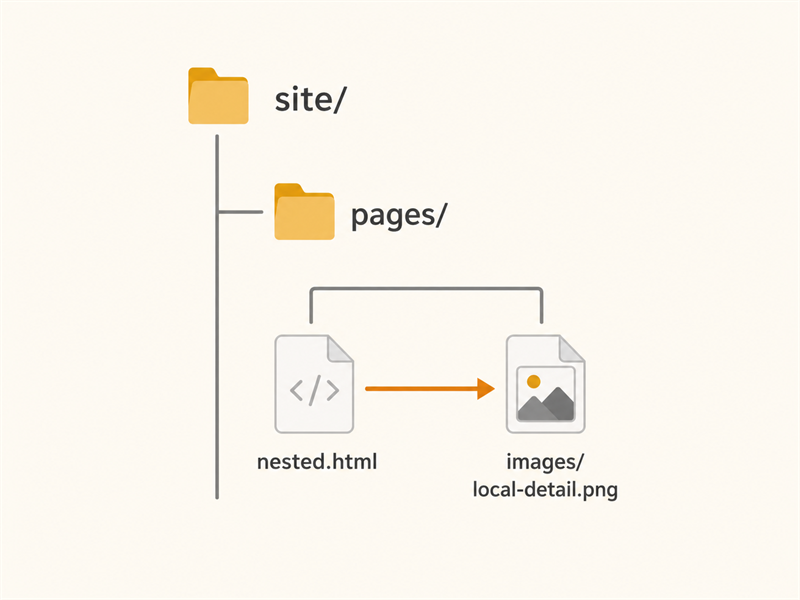

# Markdown Example

This page is written in Markdown and converted to HTML when Diesel runs with the `--md` flag.
It shows common GitHub Flavored Markdown features without GitHub-only references like issues,
pull requests, commits, teams, or people.

## Paragraphs And Line Breaks

Markdown paragraphs are separated by a blank line.
Soft line breaks stay inside the same paragraph unless the renderer chooses otherwise.

Add two trailing spaces  
to force a line break.

---

## Headings

# Heading 1

## Heading 2

### Heading 3

#### Heading 4

##### Heading 5

###### Heading 6

## Emphasis

This sentence has **bold text**, *italic text*, ***bold italic text***, and ~~struck-through text~~.

You can also write inline code like `python diesel.py --config example/diesel.config --md`.

## Links And Autolinks

[Back to home](../index.html)

https://github.github.com/gfm/

<contact@example.com>

## Blockquotes

> Reusable templates keep shared HTML in one place.
>
> Nested blockquotes work too:
>
> > Markdown content can still live inside a full HTML page template.

## Lists

Unordered lists:

- Reusable templates still work on generated HTML files.
- Relative links can sit alongside normal site pages.
- Markdown keeps simple content quick to write.

Ordered lists:

1. Copy the site files.
2. Render Markdown files.
3. Insert Markdown into the page template.
4. Expand normal template markers.

Nested lists:

- Pages
  - `index.html`
  - `pages/nested.html`
  - `pages/markdown-example.md`
- Templates
  - `header.html`
  - `style.html`
  - `markdown.html`

Task lists:

- [x] Render Markdown
- [x] Wrap it in an HTML template
- [ ] Publish the static site

## Code Blocks

Indented code:

    python diesel.py --config example/diesel.config --md

Fenced code:

```python
def build_page(markdown_html: str) -> str:
    return markdown_html.replace("Diesel", "Diesel-kun")
```

Fenced code can also use tildes:

~~~html
<main class="markdown-body">
    {{markdown}}
</main>
~~~

## Tables

| File | Role | Processed |
| --- | --- | --- |
| `index.html` | Normal page | Yes |
| `pages/nested.html` | Nested normal page | Yes |
| `pages/markdown-example.md` | Markdown source | Converted to HTML |
| `templates/markdown.html` | Markdown page template | Used during Markdown rendering |

Aligned columns:

| Left | Center | Right |
| :--- | :---: | ---: |
| Alpha | Beta | Gamma |
| 10 | 20 | 30 |

## Images



## Escaping

Use a backslash when you want Markdown punctuation to appear literally:

\*This is not emphasized.\*

\# This is not a heading.

## HTML

Inline HTML can be included when the renderer allows it.

<details>
<summary>Open this detail block</summary>

This content is inside an HTML `<details>` element.

</details>

## Footnotes

Diesel can render footnotes when the Markdown renderer supports them.[^note]

[^note]: Footnotes are useful for side comments without interrupting the main page.

## Back Home

[Back to home](../index.html)
